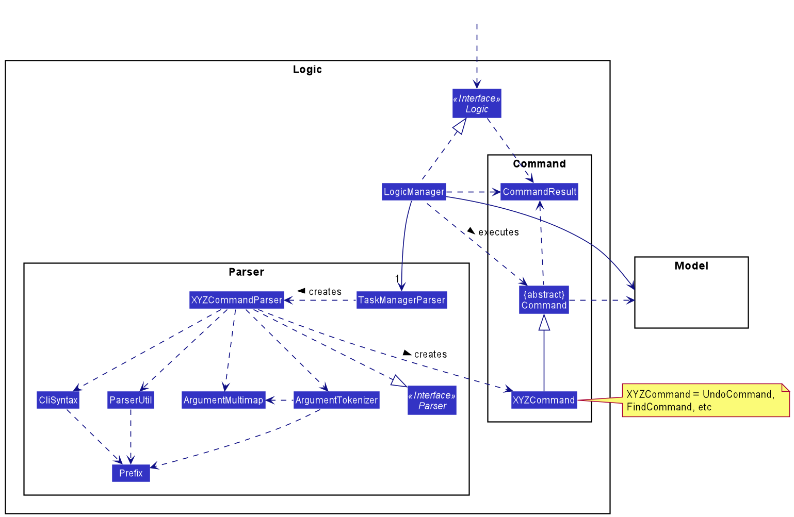
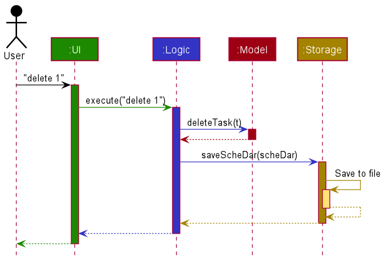
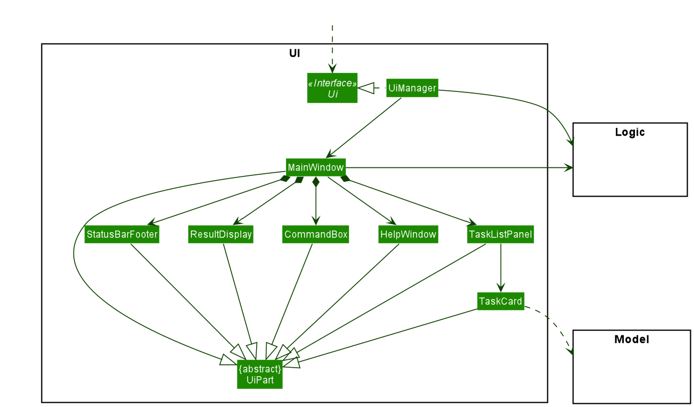
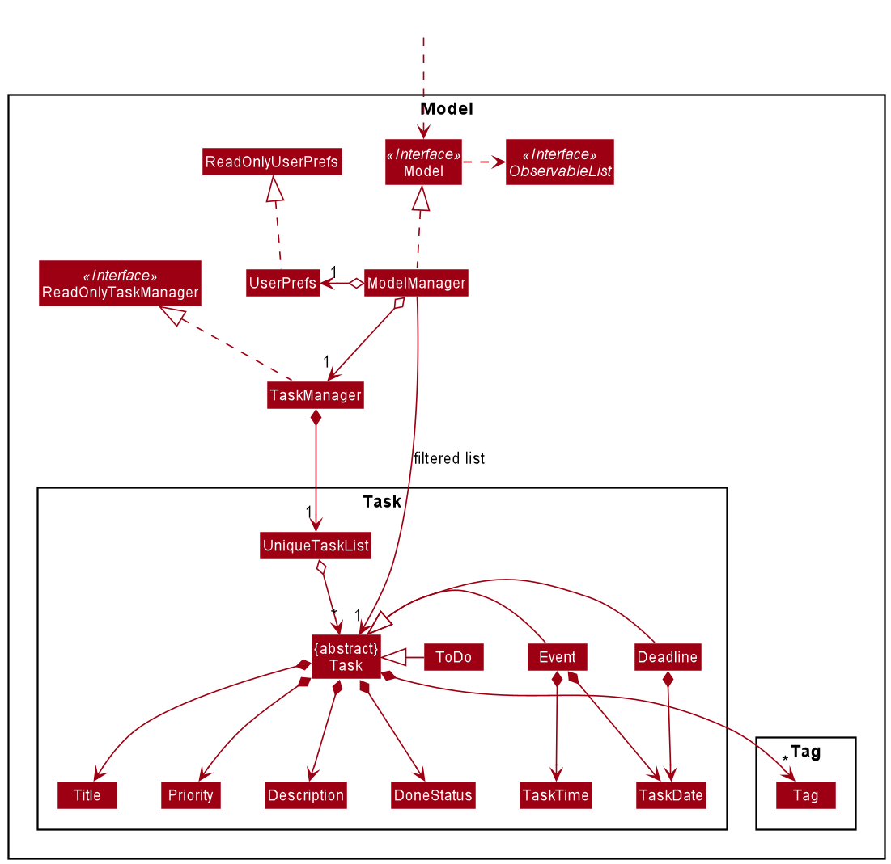
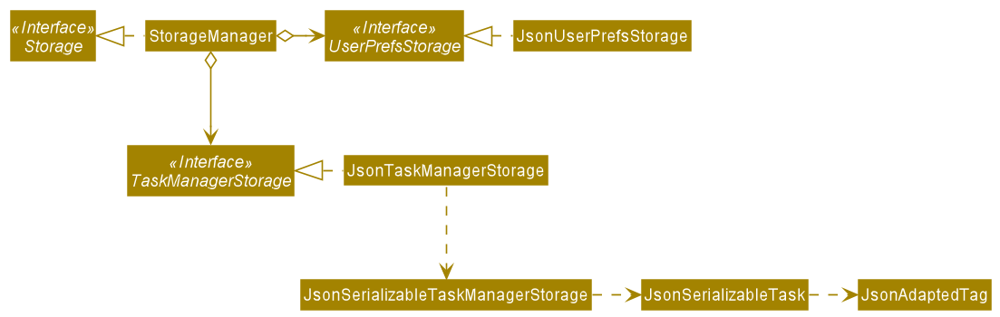
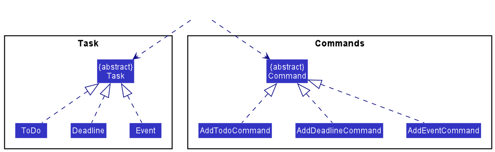
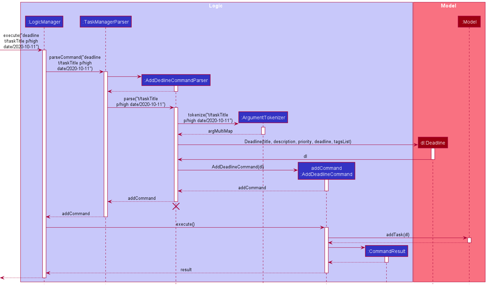
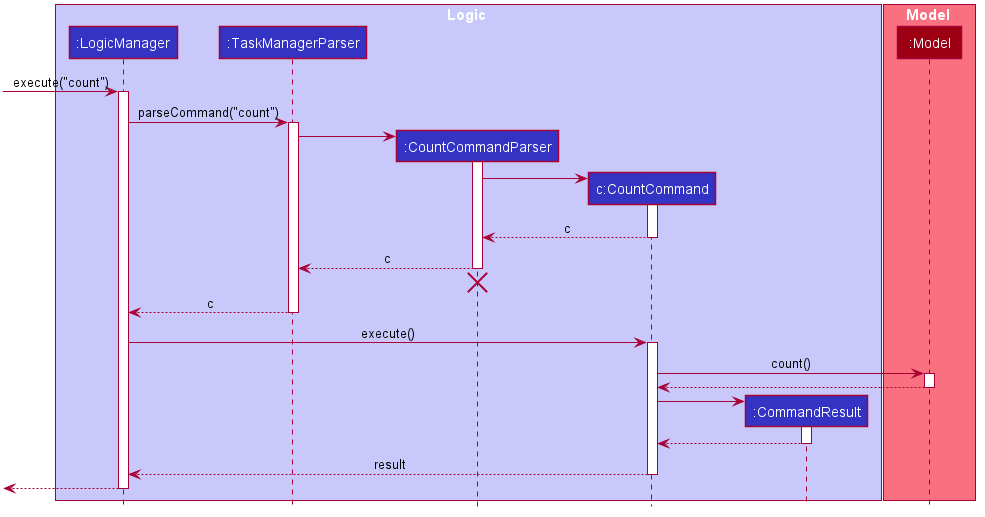
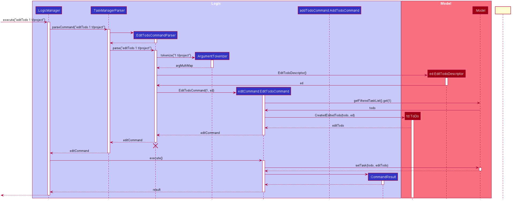

* Table of Contents
{:toc}

--------------------------------------------------------------------------------------------------------------------

## **Setting up, getting started**

Refer to the guide [_Setting up and getting started_](SettingUp.md).

--------------------------------------------------------------------------------------------------------------------

## **Design**

### Architecture

The ***Architecture Diagram*** given above explains the high-level design of the App. Given below is a quick overview of each component.

:bulb: **Tip:** The `.puml` files used to create diagrams in this document can be found in the [diagrams](https://github.com/se-edu/addressbook-level3/tree/master/docs/diagrams/) folder. Refer to the [_PlantUML Tutorial_ at se-edu/guides](https://se-education.org/guides/tutorials/plantUml.html) to learn how to create and edit diagrams.

**`Main`** has two classes called [`Main`](https://github.com/AY2021S1-CS2103-T16-4/tp/blob/master/src/main/java/seedu/schedar/Main.java) and [`MainApp`](https://github.com/AY2021S1-CS2103-T16-4/tp/blob/master/src/main/java/seedu/schedar/MainApp.java). It is responsible for,
* At app launch: Initializes the components in the correct sequence, and connects them up with each other.
* At shut down: Shuts down the components and invokes cleanup methods where necessary.

[**`Commons`**](#common-classes) represents a collection of classes used by multiple other components.

The rest of the App consists of four components.

* [**`UI`**](#ui-component): The UI of the App.
* [**`Logic`**](#logic-component): The command executor.
* [**`Model`**](#model-component): Holds the data of the App in memory.
* [**`Storage`**](#storage-component): Reads data from, and writes data to, the hard disk.

Each of the four components,

* defines its *API* in an `interface` with the same name as the Component.
* exposes its functionality using a concrete `{Component Name}Manager` class (which implements the corresponding API `interface` mentioned in the previous point.

For example, the `Logic` component (see the class diagram given below) defines its API in the `Logic.java` interface and exposes its functionality using the `LogicManager.java` class which implements the `Logic` interface.

**How the architecture components interact with each other**

The *Sequence Diagram* below shows how the components interact with each other for the scenario where the user issues the command `delete 1`.

The sections below give more details of each component.

### UI component

**API** :
[`Ui.java`](https://github.com/AY2021S1-CS2103-T16-4/tp/blob/master/src/main/java/seedu/schedar/ui/Ui.java)

The UI consists of a `MainWindow` that is made up of parts e.g.`CommandBox`, `ResultDisplay`, `PersonListPanel`, `StatusBarFooter` etc. All these, including the `MainWindow`, inherit from the abstract `UiPart` class.

The `UI` component uses JavaFx UI framework. The layout of these UI parts are defined in matching `.fxml` files that are in the `src/main/resources/view` folder. For example, the layout of the [`MainWindow`](https://github.com/se-edu/addressbook-level3/tree/master/src/main/java/seedu/address/ui/MainWindow.java) is specified in [`MainWindow.fxml`](https://github.com/se-edu/addressbook-level3/tree/master/src/main/resources/view/MainWindow.fxml)

The `UI` component,

* Executes user commands using the `Logic` component.
* Listens for changes to `Model` data so that the UI can be updated with the modified data.

### Logic component

**API** :
[`Logic.java`](https://github.com/AY2021S1-CS2103-T16-4/tp/blob/master/src/main/java/seedu/schedar/logic/Logic.java)

1. `Logic` uses the `TaskManagerParser` class to parse the user command.
1. This results in a `Command` object which is executed by the `LogicManager`.
1. The command execution can affect the `Model` (e.g. adding a task, such as ToDo).
1. The result of the command execution is encapsulated as a `CommandResult` object which is passed back to the `Ui`.
1. In addition, the `CommandResult` object can also instruct the `Ui` to perform certain actions, such as displaying help to the user.

Given below is the Sequence Diagram for interactions within the `Logic` component for the `execute("delete 1")` API call.

:information_source: **Note:** The lifeline for `DeleteCommandParser` should end at the destroy marker (X) but due to a limitation of PlantUML, the lifeline reaches the end of diagram.

### Model component

**API** : [`Model.java`](https://github.com/AY2021S1-CS2103-T16-4/tp/blob/master/src/main/java/seedu/schedar/model/Model.java)

The `Model`,

* stores a `UserPref` object that represents the user’s preferences.
* stores the task manager data.
* exposes an unmodifiable `ObservableList<Task>` that can be 'observed' e.g. the UI can be bound to this list so that the UI automatically updates when the data in the list change.
* does not depend on any of the other three components.

### Storage component

**API** : [`Storage.java`](https://github.com/AY2021S1-CS2103-T16-4/tp/blob/master/src/main/java/seedu/schedar/storage/Storage.java)

The `Storage` component,
* can save `UserPref` objects in json format and read it back.
* can save the task manager data in json format and read it back.

### Common classes

Classes used by multiple components are in the `seedu.schedar.commons` package.

--------------------------------------------------------------------------------------------------------------------

## **Implementation**

This section describes some noteworthy details on how certain features are implemented.

### Adding Tasks

#### Implementation

ScheDar supports 3 types of tasks: `ToDo`s, `Deadline`s, and `Event`s. As the 3 types of tasks share many common attributes and features, such as a title, description, and priority level, they all inherit from the same abstract class `Task`. Some attributes, like dates, are only relevant to some types of tasks, such as `Deadline`, and are thus not present in the other types such as `ToDo`.

Each type of task has it own corresponding command to add that specific type of task. All of the commands extend the `Command` class. Currently, the commands are:
* `AddTodoCommand` for `ToDo`-type Tasks
* `AddDeadlineCommand` for `Deadline`-type Tasks
* `AddEventCommand` for `Event`-type Tasks

All of the commands extend the `Command` class. However, as each type of task stores different types of variables as required (such as date or time), each task may have different command parameters, and thus would need to be parsed differently. Thus, each command is given its own class for simplicity and extendability.

Given below is an example for adding a `Deadline`-type task to ScheDar:

Step 1: The user inputs the command `deadline t/taskTitle p/high date/2020-10-11`, which is supposed to create a `Deadline`-type Task, with a title `taskTitle`, priority `High`, and deadline date of 11 October 2020. Description and tags, which are optional, have been omitted.

Step 2: The input command is passed into `LogicManager` from the UI.

Step 3: `LogicManager` calls on the `parseCommand()` method of `TaskManagerParser` to parse the command. Upon recognising the input as a command to add a `Deadline`-type task, `TaskManagerParser` calls on `AddDeadlineCommandParser` to process the input parameters.

Step 4: `AddDeadlineCommandParser` calls on the `tokenize` method of `ArgumentTokenizer` to tokenize the commands into an `ArgumentMultiMap`. It then extracts the values for each command parameter, and uses them to create the `Deadline` object.

Step 5: `AddDeadlineCommandParser` uses the `Deadline` object to create an `AddDeadlineCommand` object, which is returned to `TaskManagerParser`, then `LogicManager` for execution.

Step 6: `LogicManager` calls on the `execute()` method of the `AddDeadlineCommand` object, which adds the `Deadline` to the ScheDar's task manager.

Step 7: Upon successful execution, a `CommandResult` object is created, and returned to `LogicManager` and then the UI, where a success message is displayed to the user.

The following sequence diagram shows how a typical add operation, as explained in steps 2 to 7 above, works:

#### Design Considerations

##### Aspect: How different Task types are implemented

* **Alternative 1 (current choice):** Each type of task is its own class, which inherits from `Task`.
  * Pros: Allows different types of tasks to have different variables and task-specific behaviour. For example, in future, `Deadline`-type tasks can have reminders, but not `ToDo` or `Event`.
  * Cons: Managing `Task`s of different classes within the same task manager adds complexity.

* **Alternative 2:** Have a single `Task` class, with some attributes such as dates, being optional.
  * Pros: Only a single type of `Task` to manage. Less error prone.
  * Cons: Difficult to extend or customise behaviour for the different types of tasks.

##### Aspect: How commands to add different types of tasks are implemented

* **Alternative 1 (current choice):** Each type of task has its own add command, such as `todo` and `deadline`.
  * Pros: The parser would be aware of the type of task being added, and can show the user an error message if an invalid parameter is added, such as a date to a `ToDo`-type task.
  * Cons: There are multiple add commands, and the commands are longer, making the process more inconvenient for users.

* **Alternative 2:** Have a single `add` command, with the type of task being determined by the attributes supplied by the user, or a separate parameter like `/todo`.
  * Pros: User only needs to know a single command to add tasks.
  * Cons: The logic needed to process the command would be more complex, and thus may be more prone to errors.
  
### Count Tasks

#### Implementation

ScheDar has the ability to count the number of tasks in current task list.

Given below is an example for counting tasks.

Step 1: The user inputs the command `count`.

Step 2: The input command is passed into `LogicManager` from the UI.

Step 3: `LogicManager` calls on the `parseCommand()` method of `TaskManagerParser` to parse the command. Upon recognising the input as a count command, `TaskManagerParser` calls on `CountCommandParser` to process the input parameters.

Step 4: `CountCommandParser` creates a `CountCommand` object, which is returned to `TaskManagerParser`, then `LogicManager` for execution.

Step 5: `LogicManager` calls on the `execute()` method of the `CountCommand` object, which counts the tasks in ScheDar.

Step 6: Upon successful execution, a `CommandResult` object is created, and returned to `LogicManager` and then the UI, where a success message is displayed to the user.

The following sequence diagram shows how a typical add operation, as explained in steps 2 to 6 above, works:

#### Design Considerations

##### Aspect: Displays more statistics details to user

* **Alternative 1 (current choice):** Display only the total number of tasks to the user.
  * Pros: Easier to implement. Less error prone.
  * Cons: Information displayed to user is limited.
  
* **Alternative 2:** Display the total number of tasks as well as the number of tasks of each type (todo/event/deadline), and the number of done/undone tasks. 
  * Pros: Displays more useful information to the user.
  * Cons: More error prone.
  
* Alternative 1 can be extended to Alternative 2. Due to time limit, we did not implement the extension.

### Editing Tasks

#### Implementation

Similar to add command, each type of task has it own corresponding edit command. All of the commands extend the `Command` class. Currently, the commands are:
* `EditTodoCommand` for `ToDo`-type Tasks
* `EditDeadlineCommand` for `Deadline`-type Tasks
* `EditEventCommand for `Event`-type Tasks

As each type of task stores different types of variables as required (such as date or time), each task may have different command parameters, and thus would need to be parsed differently. 

Given below is an example for editing a `ToDo`-type task.

Step 1: The user inputs the command `editTodo 1 t/project`, which is supposed to edit`ToDo` at index `1` with a new title `project`.

Step 2: The input command is passed into `LogicManager` from the UI.

Step 3: `LogicManager` calls on the `parseCommand()` method of `TaskManagerParser` to parse the command. Upon recognising the input as a command to edit a `ToDo`-type task, `TaskManagerParser` calls on `EditTodoCommandParser` to process the input parameters.

Step 4: `EditTodoCommandParser` calls on the `tokenize` method of `ArgumentTokenizer` to tokenize the commands into an `ArgumentMultiMap`. It then extracts the values for each command parameter, and uses them to create the `EditTodoDescriptor` object.

Step 5: `EditTodoCommandParser` uses the `EditTodoDescriptor` object to create an `EditTodoCommand` object, which is returned to `TaskManagerParser`, then `LogicManager` for execution.

Step 6: `LogicManager` calls on the `execute()` method of the `EditTodoCommand` object, which edits the `ToDo` in the ScheDar's task manager.

Step 7: Upon successful execution, a `CommandResult` object is created, and returned to `LogicManager` and then the UI, where a success message is displayed to the user.

The following sequence diagram shows how a typical add operation, as explained in steps 2 to 7 above, works:

#### Design Considerations
  
##### Aspect: How commands to edit different types of tasks are implemented

* **Alternative 1 (current choice):** Each type of task has its own edit command.
  * Pros: The parser would be aware of the type of task being edited, and can show the user an error message if an invalid parameter is edited.
  * Cons: There are multiple edit commands, and the commands are longer, making the process more inconvenient for users.
  
* **Alternative 2:** Have a single `edit` command, with the type of task being determined by its index number provided.
  * Pros: The command is easier for user.
  * Cons: The logic needed to process the command would be more complex. More error prone.

--------------------------------------------------------------------------------------------------------------------

## **Documentation, logging, testing, configuration, dev-ops**

* [Documentation guide](Documentation.md)
* [Testing guide](Testing.md)
* [Logging guide](Logging.md)
* [Configuration guide](Configuration.md)
* [DevOps guide](DevOps.md)

--------------------------------------------------------------------------------------------------------------------

## **Appendix: Requirements**

### Product scope

**Target user profile**:

* NUS CS Students
* prefer desktop apps over other types
* can type fast
* prefers typing to mouse interactions
* is reasonably comfortable using CLI apps
* seeking an integrated calendar and task management application to plan their schedule

**Value proposition**: Assist students in the planning of their lecture and tutorial schedules, as well as keep track of assignments and deadlines.

### User stories

Priorities: High (must have) - `* * *`, Medium (nice to have) - `* *`, Low (unlikely to have) - `*`

| Priority | As …​                                    | I want to …​                     | So that I can…​                                                        |
|:--------:| ------------------------------------------ | ------------------------------ | ---------------------------------------------------------------------- |
| `* * *`  | a new user                                   | have access to user guide/help file easily |learn more about the software easily when I need            |
| `* * *`  | a student                                  | see the time of my lessons and meetings |      plan my day.                                             |
| `* * *`  | a student                                  | see my deadlines at a glance   | prioritise my work.                                                    |
| `* * *`  | a student                                  | assign priorities to my different tasks | know which ones I should do first |
| `* * *`  | a student                                  | delete tasks    | remove cancelled obligations.        |
| `* * *`  | a student with many tasks                  |search through my task using keywords   | I can find relevant tasks quickly |
| `* * *`  | an advanced user                           |edit the source file of todo list directly   |make changes without going through the CLI|
|`* *`| a NUS student | add my periodic asks at once | avoid adding them repeatedly |
| `* *` | a student bad at remembering deadlines | sort my deadlines based on date | know which deadline is coming soon |
| `* *` | an efficient student | type abbreviated commands | type super fast |
| `* *` | a student | see the statistics of my tasks | preview the workload I will encounter in the coming weeks |
| `* *` | self-consistent NUS student | add task to different task | make my plan well organised |
| `* *` | a NUS student |  add class schedule by module code |  |
| `*` | an every day user | receive a warm welcome when I open the app | feel pleased |
| `*` | a student likes customisation | customise some parts of UI | feel more comfortable when I use it |
| `*` | a student | set a free day for my timetable by making proper arrangement | have a long weekend |
| `*` | a user | get notifications for recent events and coming deadlines | will not miss them |
| `*` | an organised user | be able to add tags to my task and filter by tags | sort my tasks by topic |
| `*` | a lazy user | past and add a bunch of different tasks at once through command line | add them fastly |
| `*` | a student with a lot of group projects | assiciate tasks with people | keep track which group member is doing what |
| `*` | an advanced user | add dates to todos to convert them to events/deadlines | I don't have to delete and create a new task |
| `*` | a user | change the description of a task | update them without deleting |
| `*` | a forgetful user | have duplicate tasks deleted | avoid the same task appearing twice |
| `*` | a lazy student | have acces to links to websites or file in the description | have access to related resources easily |
| `*` | a careless student | undo my commands | avoid misoperation |
| `*` | a normal user |  go through my tasks opon opening the app | be well informed |

### Use cases

(For all use cases below, the **System** is the `ScheDar` and the **Actor** is the `user`, unless specified otherwise)

**Use case: add a task**

**MSS**

1. User enters add command specifying task type
2. ScheDar give a response

    Use case ends.
    
**Use case: count the number of tasks**

**MSS**

1. User requests to count the number of tasks in the list
2. ScheDar count tasks

    Use case ends.

**Use case: delete a task**

**MSS**

1. User requests to delete a specific task in the list
2. ScheDar deletes the task

    Use case ends.

**Extensions**

* 2a. The list is empty.

  Use case ends.

* 3a. The given index is invalid.

    * 3a1. ScheDar shows an error message.

      Use case resumes at step 1.

**Use case: assign priority to a task**

**MSS**

1. User requests to assign priority a specific task in the list
2. ScheDar gives priority to the task

    Use case ends.

**Extensions**

* 2a. The list is empty.

  Use case ends.

* 3a. The given index is invalid.

    * 3a1. ScheDar shows an error message.

      Use case resumes at step 1.

* 4a. The task already have a priority.

    * 4a1. ScheDar shows a confirmation about overriding.

         * 4a1a User confirms override

         * ScheDar gives new priority to the task

           Use case ends

         * 4a1a User denies override

           Use case resumes at step 1.

**Use case: mark a task as done**

**MSS**

1. User requests to mark a specific task in the list as done
2. ScheDar marks the task

    Use case ends.

**Extensions**

* 2a. The list is empty.

  Use case ends.

* 3a. The given index is invalid.

    * 3a1. ScheDar shows an error message.

      Use case resumes at step 1.

* 4a. The task is already done.

    * 3a1. ScheDar shows an error message.

      Use case resumes at step 1.

**Use case: retrieve last-deleted task**

**MSS**

1. User requests to retrieve a last-deleted task
2. ScheDar retrieves the task

    Use case ends.

**Extensions**

* 2a. The rubbish bin is empty.

    * 2a1. ScheDar shows an error message.

  Use case ends.
  
* 2a. Retrieving the last-deleted task will cause a duplicate of tasks.
  
    * 2a1. ScheDar shows an error message.
  
  Use case ends.

**Use case: search for tasks by keyword**

**MSS**

1. User requests search with keyward
2. ScheDar get matched tasks and list them

    Use case ends.

**Extensions**

* 2a. The keyword is not found.

   * 3a1. ScheDar shows an warning message.

  Use case ends.

**Use case: sort tasks according to date**

**MSS**

1. User requests to sort task shown in the list
2. ScheDar sorts tasks

    Use case ends.
    
**Use case: exit**

**MSS**

1. User requests to exit ScheDar
2. ScheDar exits

    Use case ends.

*{More to be added}*

### Non-Functional Requirements

1.  Should work on any _mainstream OS_ as long as it has Java `11` or above installed.
2.  Should be able to hold up to 1000 tasks without a noticeable sluggishness in performance for typical usage.
3.  A user with above average typing speed for regular English text (i.e. not code, not system admin commands) should be able to accomplish most of the tasks faster using commands than using the mouse.

*{More to be added}*

### Glossary

* **Mainstream OS**: Windows, Linux, Unix, OS-X

--------------------------------------------------------------------------------------------------------------------

## **Appendix: Instructions for manual testing**

Given below are instructions to test the app manually.

:information_source: **Note:** These instructions only provide a starting point for testers to work on;
testers are expected to do more *exploratory* testing.

### Launch and shutdown

1. Initial launch

   1. Download the jar file and copy into an empty folder

   1. Double-click the jar file Expected: Shows the GUI with a set of sample contacts. The window size may not be optimum.

1. Saving window preferences

   1. Resize the window to an optimum size. Move the window to a different location. Close the window.

   1. Re-launch the app by double-clicking the jar file. 
       Expected: The most recent window size and location is retained.

1. _{ more test cases …​ }_

### Deleting a person

1. Deleting a person while all persons are being shown

   1. Prerequisites: List all persons using the `list` command. Multiple persons in the list.

   1. Test case: `delete 1` 
      Expected: First contact is deleted from the list. Details of the deleted contact shown in the status message. Timestamp in the status bar is updated.

   1. Test case: `delete 0` 
      Expected: No person is deleted. Error details shown in the status message. Status bar remains the same.

   1. Other incorrect delete commands to try: `delete`, `delete x`, `...` (where x is larger than the list size) 
      Expected: Similar to previous.

1. _{ more test cases …​ }_

### Saving data

1. Dealing with missing/corrupted data files

   1. _{explain how to simulate a missing/corrupted file, and the expected behavior}_

1. _{ more test cases …​ }_
